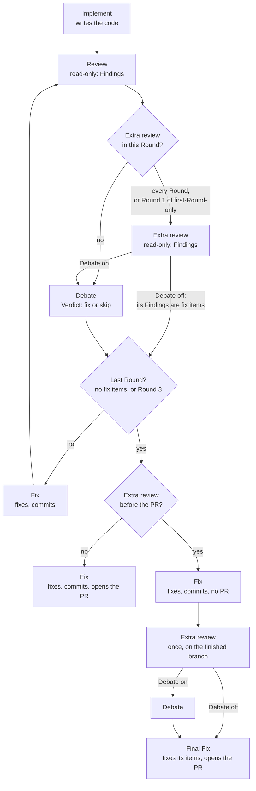

# Extra review: where it runs and who does what

An Area label may add an Extra review to its Tickets: a second review with its own skill, App, model and effort. The label sets two things: its **position** (every Round, first Round only, or before the PR) and its **Debate switch** (its Findings join the Debate, or go straight to the Fix). Decided on the Waypoint "Extra Stages by Ticket label: the security review and what it returns" (harness-bsg.8).

## The Pipeline with an Extra review

A Round opened unreviewed (the Review's App at its limit, the user answering "open the PR unreviewed") skips the Review, the Extra review and the Debate. A before-the-PR Extra review is skipped too. The Question's option names the Extra review, and the PR lists both as unreviewed.

## Who does what

| Stage | Runs | Changes code | Gets | Gives |
|---|---|---|---|---|
| Implement | stage-implement, the label's skills and guidance | yes | the Ticket | commits |
| Review | stage-review with the review job's Delegate skill, on the review row | no | the diff | Findings |
| Extra review | stage-review with the label's review skill, on the label's own App, model and effort | no | the diff, earlier result and Verdict files | Findings |
| Debate | the Moderator and sides A and B | no | the Review's Findings, the Extra review's when Debate is on, the audit's | a Verdict |
| Fix | stage-fix, the label's skills and guidance | yes | the Verdict's fix items, plus the Extra review's Findings when Debate is off (marked "not debated") | commits; in the last Round, the PR, unless an Extra review runs before it |
| Final Fix | stage-fix, only with an Extra review before the PR | yes | the Extra review's fix items | commits, the PR |

Every Stage that needs a decision asks through a Question; under Away its Ticket parks.

## The shipped labels

| Label | Extra review | Position | Debate |
|---|---|---|---|
| orqa:security | getsentry security-review | every Round | on |
| orqa:infra | its offline checks (terraform, tflint, trivy, hadolint, kubeconform, actionlint); what exactly it runs is its own Waypoint | every Round | off: the Fix fixes what fails |
| the other Area labels | none | | |

Modifier labels never carry one. A Ticket has at most one Area label, so it has at most one Extra review.

## Rules

- **Usage limit:** when the Extra review's App hits its limit, the Ticket is Limited, as with Implement or Fix. It resumes at the reset; a long limit ends the run, and /continue resumes it. There is no Question, no fallback row, and it is never skipped.
- **Rows:** an empty App, model or effort falls back to the Review's row.
- **A new label:** its Extra review defaults to every Round, Debate on.
- **Rounds:** Findings that skip the Debate count as fix items, so they keep the Rounds going. Any still open at Round 3's cap go on the PR with the other leftovers.
- **Config:** on the /config Ticket labels page, each label has an Extra review skill, a position, the Debate switch, and an App, model and effort.
