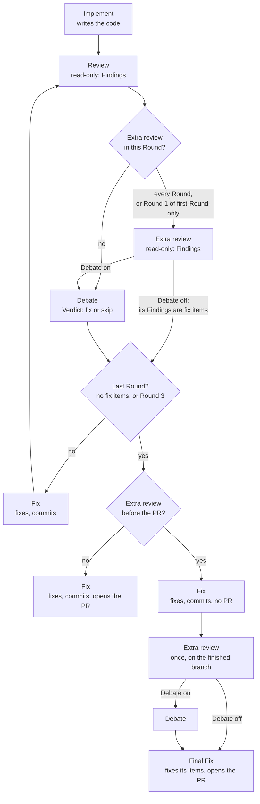

# Extra review: where it runs and who does what

An Area label may add an Extra review to its Tickets: a second review with its own skill, App, model and effort. The label sets two things: its **position** (every Round, first Round only, or before the PR) and its **Debate switch** (its Findings join the Debate, or go straight to the Fix). Decided on the Waypoint "Extra Stages by Ticket label: the security review and what it returns" (harness-bsg.8).

## The Pipeline with an Extra review

A Round opened unreviewed (the Review's App at its limit, the user answering "open the PR unreviewed") skips the Review, the Extra review and the Debate. A before-the-PR Extra review is skipped too. The Question's option names the Extra review, and the PR lists both as unreviewed.

## Who does what

| Stage | Runs | Changes code | Gets | Gives |
|---|---|---|---|---|
| Implement | stage-implement, the label's skills and guidance | yes | the Ticket | commits |
| Review | stage-review with the review job's Delegate skill, on the review row | no | the diff | Findings |
| Extra review | stage-review with the label's review skill, on the label's own App, model and effort | no | the diff, earlier result and Verdict files | Findings |
| Debate | the Moderator and sides A and B | no | the Review's Findings, the Extra review's when Debate is on, the audit's | a Verdict |
| Fix | stage-fix, the label's skills and guidance | yes | the Verdict's fix items, plus the Extra review's Findings when Debate is off (marked "not debated") | commits; in the last Round, the PR, unless an Extra review runs before it |
| Final Fix | stage-fix, only with an Extra review before the PR | yes | the Extra review's fix items | commits, the PR |

Every Stage that needs a decision asks through a Question; under Away its Ticket parks.

## The shipped labels

| Label | Extra review | Position | Debate |
|---|---|---|---|
| orqa:security | getsentry security-review | every Round | on |
| orqa:infra | infra-review, a Shipped skill that runs the offline checks (below) | every Round | off: the Fix fixes what fails |
| the other Area labels | none | | |

Modifier labels never carry one. A Ticket has at most one Area label, so it has at most one Extra review.

## Rules

- **Usage limit:** when the Extra review's App hits its limit, the Ticket is Limited, as with Implement or Fix. It resumes at the reset; a long limit ends the run, and /continue resumes it. There is no Question, no fallback row, and it is never skipped.
- **Rows:** an empty App, model or effort falls back to the Review's row.
- **A new label:** its Extra review defaults to every Round, Debate on.
- **Rounds:** Findings that skip the Debate count as fix items, so they keep the Rounds going. Any still open at Round 3's cap go on the PR with the other leftovers.
- **Config:** on the /config Ticket labels page, each label has an Extra review skill, a position, the Debate switch, and an App, model and effort.
- **fetch.sh:** before an Extra review, if its skill's folder has a fetch.sh, the Orchestrator runs it in the worktree with network, in the background, and passes it a cache directory. If the script fails, a Question offers Retry or Run without.

## orqa:infra's offline checks

Decided on the Waypoint "orqa:infra's Extra review: what the check runs, and fetching its offline prerequisites" (harness-bsg.21). The tool facts are in docs/research/infra-label.md on research/infra-label.

- **Tools.** infra-review runs only the tools that match files the diff touches:
  - terraform fmt, validate, and test with mock_provider;
  - tflint, with its bundled ruleset plus any plugins the repo's .tflint.hcl names;
  - trivy config --skip-check-update;
  - hadolint;
  - helm lint, and helm template piped into kubeconform;
  - actionlint, with shellcheck.

  checkov is left out, because trivy covers the same ground and gives severities.
- **Findings.** Every result is a Finding, because the review cannot change code and the Debate is off.
  - Severities follow the research's §3.3.
  - An unformatted file is `(low) path — run terraform fmt`.
  - A failing mocked test is `(high)` on its .tftest.hcl file.
  - kubeconform and helm lint give no line, so the skill finds the line from the kind, name and path, or reports the file alone.
  - Checks that did not run go in a `## Not run` section of the result file, and the last Fix copies it onto the PR.
- **Preflight.** With orqa:infra configured, preflight blocks while any of these is missing: terraform ≥ 1.7, tflint, trivy, hadolint, helm, kubeconform, actionlint, shellcheck.
- **Prerequisites.** infra-review's fetch.sh runs before every infra Extra review, so it picks up providers a Round adds. It writes to .orqadence-local/cache/infra, which every worktree of the checkout shares.
  - It works on temp copies of the touched Terraform roots and never writes the worktree.
  - It fills the provider cache.
  - It keeps each touched root's .terraform/modules, so registry and git modules init offline.
  - It runs tflint --init, taking GITHUB_TOKEN from gh auth token.
  - It warms kubeconform's schema cache.
- **In the review.** The worktree is read-only, so each touched Terraform root is copied to $TMPDIR, then initialised offline with init -backend=false -plugin-dir pointing at the cache, and -get=false over the cached modules. A CRD with no schema is skipped and listed under Not run.
- **Fetch failure.** On Run without, validate, the mocked tests, kubeconform and tflint's plugins are marked not run. Under Away, the Ticket parks.
- **Lock file.** The review and fetch.sh never touch the worktree's .terraform.lock.hcl. Implement and Fix commit a change to it only when the Ticket adds or upgrades a provider. Then they regenerate it with terraform providers lock for every platform the lock file already lists. Without network, that step is Manual work.
